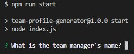
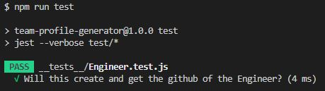

# Team Profile Generator

## Description
This repo contains code for Challenge 10 of the Bootcamp. In this challenge we needed to create a CLI app that would use inquirer to generate a webpage for displaying members of a Developer Team. The app asks for info about the Manager and asks the user if they would like to add any Engineers or Interns to the team. When the user is done adding team members, the app generates a html file using fs that shows the team the user has created. This repo also contains a folder of tests that test if the classes for the different types of employees are created successfully. 

## Installation
This project uses inquirer. Inquirer was installed by running `npm i`

## Usage
>To use the Team Profile Generator enter `npm run start` into the Command Line. This will have inquirer begin asking the prompts.  

>To run the tests enter `npm run test` into the Command Line. This will run the tests on the Employee classes.  

## License
N/A

